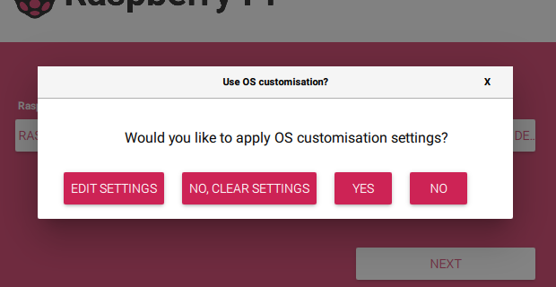
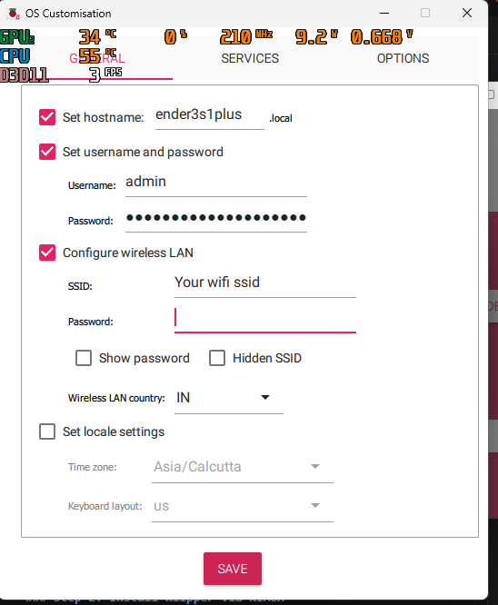
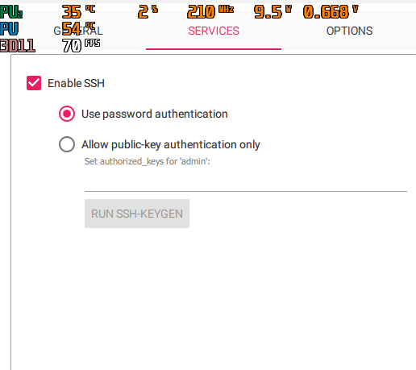
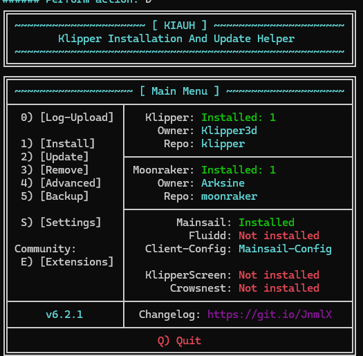
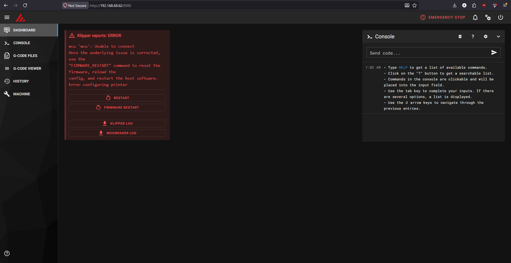

# Ender 3 S1 Plus - Klipper Installation Guide

A step-by-step guide to setting up Klipper on a bare Raspberry Pi for the Ender 3 S1 Plus.

---

## Important Links

- **Klipper:** https://www.klipper3d.org/
- **Mainsail:** https://docs.mainsail.xyz/
- **Fluidd:** https://docs.fluidd.xyz/
- **Raspberry Pi Imager (OS):** https://www.raspberrypi.com/software/
- **Video Guide:** https://www.youtube.com/watch?v=N41JY1Gukuk

---

## Part 1: Installing Klipper on Raspberry Pi

We'll be using [KIAUH](https://github.com/dw-0/kiauh) (Klipper Installation And Update Helper) to install Klipper and its components.

### Step 1: Flash the OS

1. Download and install the **Raspberry Pi Imager** from the link above.
2. Select your **Raspberry Pi model**.
3. Choose the OS: **Raspberry Pi OS Lite** (no desktop environment — lighter and better suited for Klipper).
4. Select your SD card.
5. When you click **Next**, a popup will appear asking **"Would you like to apply OS customization settings?"** — click **Edit Settings**.



#### General Tab
- Set a **hostname** (e.g., `ender3s1plus`).
- Set your **username and password** for the Pi.
- Enter your **WiFi SSID and password**.
- Set your **timezone and keyboard layout** (e.g., `Asia/Kolkata`, `in`).



#### Services Tab
- **Enable SSH** — choose **"Use password authentication"**.



6. Save the settings and flash the image.

### Step 2: First Boot & SSH

1. Insert the SD card into your Raspberry Pi and **power it on**.
2. Connect the Pi to a monitor via **HDMI** to check if any additional setup is needed (e.g., entering username and password).
3. Complete any on-screen setup if prompted.
4. Once the Pi is on your network, find its **local IP address** (check your router's admin page or use a network scanner).
5. **SSH into the Pi** from your computer:
   ```bash
   ssh <username>@<ip-address>
   ```

### Step 3: Install Klipper via KIAUH

1. **Install git** (if not already available):
   ```bash
   sudo apt-get update && sudo apt-get install git -y
   ```

2. **Clone KIAUH** and start it:
   ```bash
   cd ~ && git clone https://github.com/dw-0/kiauh.git
   ./kiauh/kiauh.sh
   ```

3. Use the menu to install the following (type the corresponding number and press Enter):

   - **Klipper** — The firmware that runs on your printer's mainboard. It offloads all the heavy computation (trajectory planning, kinematics) to the Raspberry Pi, resulting in smoother and faster prints with more precise control.

   - **Moonraker** — The API server that acts as the bridge between Klipper and your web interface. It exposes a REST API that Mainsail/Fluidd use to communicate with Klipper, manage files, and control the printer remotely.

   - **Mainsail** or **Fluidd** — Your web-based UI for controlling and monitoring the printer from a browser.

   Type the corresponding number for each action and press Enter.

   After installation, KIAUH should look like this:

   

### Step 4: Access the Web Interface

1. Open your browser and navigate to:
   ```
   http://<ip-address>:<port>
   ```
   The default port for **Mainsail** is `80`, and for **Fluidd** it's also `80` unless you changed it during installation.

2. You should see the web UI — your printer control dashboard (Mainsail shown below):

   

   > **Note:** If your printer isn't connected and powered on yet, you'll see errors in the dashboard. Don't worry — these will clear up once the printer is connected. Each error message usually includes its own resolution, so read the error and follow the suggested fix.

3. Upload the provided [`printer.cfg`](printer.cfg) to your Pi using the web UI:

   - In **Mainsail**: Go to the **Machine** tab on the left sidebar, then open the **Configuration** folder. Click the **Upload** button and select the `printer.cfg` file — this will replace the existing one.

   - In **Fluidd**: Go to the **Configuration** section (files icon on the left), navigate to the `config` folder, and click **Upload** to add the `printer.cfg`.

   This is the pre-configured config for the Ender 3 S1 Plus.

---
